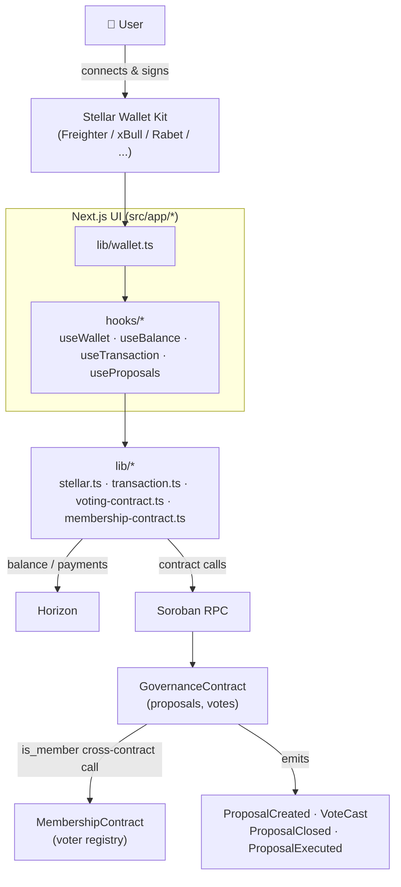
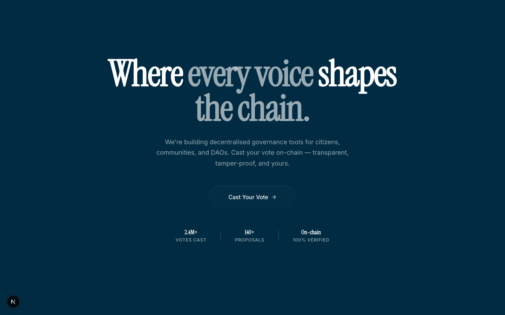
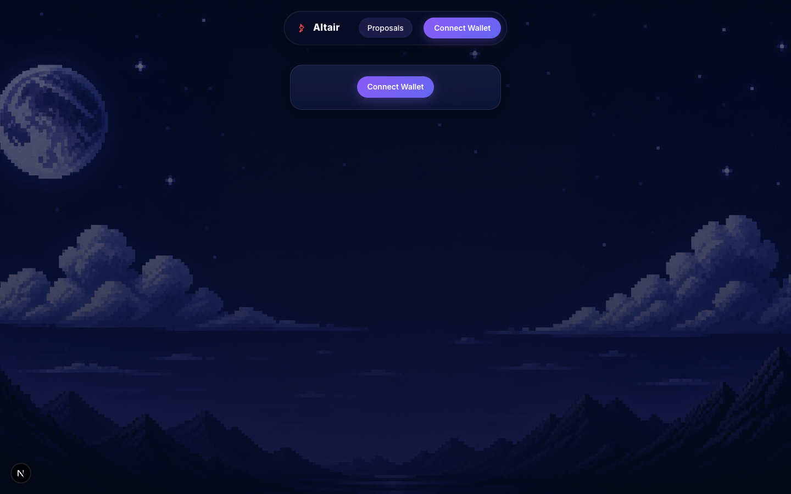
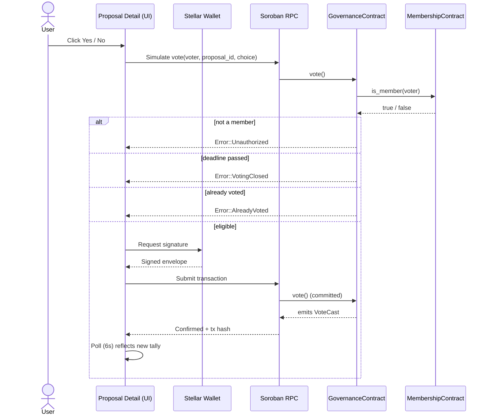

<div align="center">


# Altair

**On-chain governance voting for Stellar, with wallet-native UX.**

[](https://github.com/wolf1276/stellar-new/actions/workflows/ci.yml)
[](https://stellar4.vercel.app)
[](https://nextjs.org)
[](https://react.dev)
[](https://www.typescriptlang.org)
[](https://stellar.org)
[](https://soroban.stellar.org)
[](#license)

[Live Demo](https://stellar4.vercel.app) · [Deployed Contract](#deployed-contracts-testnet) · [Architecture](#architecture) · [Contributing](#contributing)

</div>

> **A note on accuracy:** every claim in this README is backed by code in this
> repo — contract source, hooks, or tests are linked inline. Anything that
> isn't verifiable yet (screenshots, license, live usage stats) is explicitly
> marked `TODO` rather than invented.

---

## Overview

Altair is a Next.js dApp for **wallet-connected, on-chain governance
voting** on Stellar. Anyone can connect a Stellar wallet, join a membership
registry, create a proposal, and cast a Yes/No vote — every vote, proposal
creation, and execution is a real Soroban contract call, settled on-chain,
not a mock or a database row.

**Why decentralized governance matters:** a voting record that lives in a
company's database can be edited by whoever has admin access. A voting
record that lives in a Soroban contract's persistent storage is signed by
the voter's own key and readable by anyone via Horizon — the audit trail
*is* the ledger.

**Why Stellar / Soroban:**

| | |
|---|---|
| **Sub-second finality** | Votes and executions confirm in ~5s, not minutes. |
| **Fixed, tiny fees** | A vote costs fractions of a cent — no gas auctions. |
| **Native multi-wallet support** | Freighter, xBull, Rabet, Lobstr, Hana, and more all speak the same Stellar signing protocol, so one integration (via [Stellar Wallet Kit](https://stellarwalletskit.dev/)) covers all of them. |
| **Soroban's typed storage + events** | Proposals, votes, and membership are strongly-typed contract state (`Proposal`, `VoteChoice`, `DataKey`) with events (`ProposalCreated`, `VoteCast`, `ProposalExecuted`) any indexer can subscribe to. |

---

## Features

### 🗳️ Governance & Proposals
- Create proposals with a title, description, and deadline (`create_proposal`).
- Deadlines must be at least 60 seconds out (`MIN_VOTING_SECONDS`), rejecting
  proposals that could never be voted on.
- Proposals auto-transition `Active → Closed` once their deadline passes
  (checked lazily on read, `close_if_expired`) — no cron job required.
- **Execute** a proposal after its deadline to finalize the outcome
  (`yes_votes > no_votes` → passed), emitting `ProposalExecuted`.

### ✅ Voting
- One vote per wallet per proposal, enforced on-chain (`Error::AlreadyVoted`).
- Yes/No choices only (`VoteChoice::Yes | No`), tallied in contract storage.
- Votes rejected once the deadline passes (`Error::VotingClosed`), even if
  the proposal hasn't been lazily closed yet.
- Live vote counts: `useProposalList`/`useProposal` poll the contract every
  6 seconds so votes cast by other wallets appear without a refresh
  (`src/hooks/useProposals.ts`).

### 🔐 Membership (Authorization)
- A second deployed contract, `MembershipContract`, gates who can vote.
- `vote()` calls `MembershipContractClient::is_member()` **cross-contract**
  before accepting a ballot — a real inter-contract call, not a mock (see
  `contracts/contracts/voting/src/lib.rs::vote()`).
- Membership is currently **open self-registration** (`join()` — anyone can
  call it). The frontend surfaces a "Join to Vote" gate
  (`useProposal`) before enabling Yes/No buttons.
- Swap `join()` for an admin-gated or token-balance-gated check to restrict
  membership without touching the voting contract.

### 👛 Wallet
- **Multi-wallet connect** — Freighter, xBull, Rabet, Lobstr, Hana,
  WalletConnect, Hot Wallet, Klever, OneKey, Bitget via
  [Stellar Wallet Kit](https://stellarwalletskit.dev/) — one picker modal,
  one signing API.
- Auto-reconnects on page reload via `getAuthorizedState()` (no re-prompt).
- Polls every 3s to detect an account switch or network change
  (`useWallet.ts`).
- `NetworkWarning` flags it if the wallet isn't set to Testnet.

### 🛡️ Error Handling & Security
- 8 distinct on-chain contract errors decoded into plain-English messages
  (`decodeContractError`, see the [table below](#error-handling)).
- Wallet-unavailable / wallet-rejected / invalid-address / invalid-amount
  all handled with typed errors, not generic catch blocks.
- All contract calls require `require_auth()` from the acting address —
  votes and proposal creation cannot be forged on behalf of another wallet.

### ⚡ Real-time & Performance
- 6-second silent polling (no loading flicker) for proposal lists/detail.
- `@vercel/analytics` and `@vercel/speed-insights` wired into
  `src/app/layout.tsx` (no-ops locally; active once deployed to Vercel).

---

## Tech Stack

| Layer | Technology |
|---|---|
| **Frontend** | [Next.js 16](https://nextjs.org) (App Router), [React 19](https://react.dev), [TypeScript 5](https://www.typescriptlang.org) |
| **Styling** | [Tailwind CSS 4](https://tailwindcss.com), `tailwind-merge`, minimal shadcn/ui-style primitives |
| **Blockchain** | [Stellar](https://stellar.org) (Horizon), [Soroban](https://soroban.stellar.org) (smart contracts) |
| **Smart Contracts** | [Rust](https://www.rust-lang.org) / `soroban-sdk`, Cargo workspace (`contracts/`) |
| **Wallet** | [Stellar Wallet Kit](https://stellarwalletskit.dev/), [`@stellar/freighter-api`](https://www.npmjs.com/package/@stellar/freighter-api) |
| **SDK** | [`@stellar/stellar-sdk`](https://www.npmjs.com/package/@stellar/stellar-sdk) |
| **Testing** | [Vitest](https://vitest.dev) (frontend), Cargo test (contracts) |
| **CI/CD** | GitHub Actions (`.github/workflows/ci.yml`) |
| **Hosting** | [Vercel](https://vercel.com) |
| **Monitoring** | `@vercel/analytics`, `@vercel/speed-insights` |

---

## Architecture



**Layering is one-directional**: components only call hooks, hooks only call
`lib/*`, and `lib/*` is the only layer that touches the wallet kit, Horizon,
or Soroban RPC.

---

## Folder Structure

```
src/
  app/
    page.tsx             Landing page (video hero, "Cast Your Vote" CTA)
    proposals/           List, detail (vote/execute), and create-proposal routes
  components/
    ui/                  Minimal shadcn/ui-style primitives (Button, Card, Input, Alert)
    Nav.tsx              Floating nav bar with inline Connect/Disconnect Wallet
    AppShell.tsx         Page chrome wrapper
    StatusBadge.tsx      Proposal status pill (Active/Closed/Executed)
    NetworkWarning.tsx   Alerts if the wallet is on the wrong network
  hooks/
    useWallet.tsx        Wallet-kit connection state, auto-reconnect, change polling
    useProposals.ts      Proposal list/detail/create, vote/execute actions, 6s live polling
    useBalance.ts        XLM balance fetch/refresh (not yet wired into any page)
    useTransaction.ts    Payment send lifecycle (not yet wired into any page)
  lib/
    stellar.ts           Horizon server, network passphrase, balance helpers
    wallet.ts            Stellar Wallet Kit setup (connect/sign/disconnect, multi-wallet)
    transaction.ts       Build/sign/submit XLM payments, address/amount validation
    voting-contract.ts   Soroban voting-contract read/write calls + error decoding
    membership-contract.ts  Soroban membership-contract calls (is_member/join)
    utils.ts             cn() class-merging helper
contracts/                Soroban contracts (Rust/Cargo workspace): voting + membership
```

> `useBalance`/`useTransaction` and their underlying `lib/transaction.ts`
> payment helpers exist and are tested, but no page currently renders a
> balance display or a send-XLM form — the only live UI flow is proposal
> voting. Wire them into a page to ship that feature.

---

## User Journey

```mermaid
flowchart LR
    A["Connect Wallet"] --> B["Join Membership<br/>(join)"]
    B --> C["Browse Proposals"]
    C --> D["Cast Vote<br/>(Yes / No)"]
    D --> E["Wallet Signs"]
    E --> F["Soroban Executes<br/>vote()"]
    F --> G["Proposal Tally Updates<br/>(live, 6s poll)"]
    G --> H["Deadline Passes"]
    H --> I["Execute Proposal<br/>execute_proposal()"]
    I --> J["Status: Executed<br/>ProposalExecuted event"]
```



---

## Screenshots

### Landing Page



The marketing hero (`src/app/page.tsx`) — video background, headline, and a
"Cast Your Vote" CTA into `/proposals`. The `2.4M+ / 140+` stats here are
decorative copy, not live on-chain figures (see [Project Stats](#project-stats)).

### Wallet Gate



Both `/proposals` and `/proposals/[id]` render this **Connect Wallet** gate
before showing any content — proposal data and voting are only fetched once
a wallet is connected.

| Section | Status |
|---|---|
| Proposal list (populated) | 🖼️ *placeholder — needs a connected wallet + on-chain proposals to capture* |
| Proposal detail / voting | 🖼️ *placeholder — needs a connected wallet + on-chain proposals to capture* |
| Mobile view | 🖼️ *placeholder — add screenshot* |

---

## Live Demo

| | |
|---|---|
| **Website** | https://stellar4.vercel.app |
| **Repository** | this repo |
| **Video demo** | 🚧 TODO |
| **Voting contract** | `CADQY6OJA3PZOPWIHHTJ7T67LFJJPLDDFE2UYDPJWPQVXONXM7JRSDIU` ([explorer](https://stellar.expert/explorer/testnet/contract/CADQY6OJA3PZOPWIHHTJ7T67LFJJPLDDFE2UYDPJWPQVXONXM7JRSDIU)) |
| **Example tx — `create_proposal`** | [`210388aa...`](https://stellar.expert/explorer/testnet/tx/210388aa03524f08885e9d0e4b256b1589df97f6e2d894bc5870204d400e546b) |
| **Example tx — `vote`** | [`0b42c7cc...`](https://stellar.expert/explorer/testnet/tx/0b42c7ccbeecfcbe54241f4e7ca1c066aebb5c574c51045afaf598547f38b89b) |

> ⚠️ This contract instance predates the membership cross-contract check
> (deployed with no constructor arg), so it currently runs **ungated**
> — anyone can vote. The frontend degrades to this automatically: it only
> calls the membership contract when `NEXT_PUBLIC_MEMBERSHIP_CONTRACT_ID` is
> set. Redeploy both contracts with `./deploy.sh` to get gated behavior.

---

## Installation

```bash
# 1. Clone
git clone https://github.com/wolf1276/stellar-new.git
cd stellar-new

# 2. Install
npm install

# 3. Environment variables (all optional — see table below)
cp .env.example .env.local

# 4. Run
npm run dev            # http://localhost:3000

# 5. Build
npm run build && npm run start
```

You'll need a supported wallet (e.g. [Freighter](https://freighter.app)) set
to **Testnet**, with a funded testnet account via
[Friendbot](https://friendbot.stellar.org).

---

## Environment Variables

None are required — every variable defaults to the deployed Testnet
instance. See `.env.example`.

| Variable | Required | Default | Description |
|---|:---:|---|---|
| `NEXT_PUBLIC_VOTING_CONTRACT_ID` | No | hardcoded fallback in `src/lib/voting-contract.ts` | Deployed `GovernanceContract` ID to read/write proposals against. |
| `NEXT_PUBLIC_MEMBERSHIP_CONTRACT_ID` | No | unset (voting runs ungated) | Deployed `MembershipContract` ID. Setting this enables the "Join to Vote" gate. |
| `NEXT_PUBLIC_SOROBAN_RPC_URL` | No | `https://soroban-testnet.stellar.org` | Soroban RPC endpoint. |

---

## Smart Contract

Two Soroban contracts, in a Cargo workspace under `contracts/`.

### `GovernanceContract` (`contracts/contracts/voting`)

**Purpose:** own proposal lifecycle and voting.

**Storage** (`DataKey`)
| Key | Value |
|---|---|
| `ProposalCount` | `u32` — next proposal id |
| `Proposal(id)` | `Proposal` struct (title, description, creator, deadline, status, yes/no tallies) |
| `Voted(proposal_id, voter)` | marks a wallet has voted on a proposal (prevents double-voting) |
| `MembershipContract` | `Address` of the deployed `MembershipContract`, set once at construction |

**Methods**
| Method | Auth | Description |
|---|---|---|
| `__constructor(membership_contract)` | — | Wires the deployed `MembershipContract` address at deploy time. |
| `create_proposal(creator, title, description, deadline)` | `creator` | Creates an `Active` proposal; deadline must be ≥ 60s in the future. |
| `vote(voter, proposal_id, choice)` | `voter` | Cross-contract-checks membership, then records one Yes/No vote. |
| `execute_proposal(proposal_id)` | — (permissionless) | After the deadline, marks `Executed` and reports pass/fail. |
| `get_proposal(proposal_id)` | — | Reads a proposal, lazily closing it if expired. |
| `get_all_proposals()` | — | Reads every proposal. |
| `has_voted(proposal_id, voter)` | — | Checks if a wallet already voted. |

**Events**: `ProposalCreated`, `VoteCast`, `ProposalClosed`, `ProposalExecuted`.

**Voting logic / proposal lifecycle**: `Active` → (deadline passes) → `Closed`
→ (`execute_proposal` called) → `Executed`. A proposal passes if
`yes_votes > no_votes` at execution time.

**Security**: every state-changing call requires `require_auth()` from the
acting address; votes are one-per-wallet-per-proposal; voting is rejected
once the deadline has passed even before lazy closure runs.

### `MembershipContract` (`contracts/contracts/membership`)

| Method | Auth | Description |
|---|---|---|
| `join(member)` | `member` | Self-registers a wallet as a member. |
| `is_member(member)` | — | Read-only membership check, called cross-contract by `vote()`. |

**Events**: `MemberJoined`.

> Membership is intentionally open self-registration for this demo — see the
> note in [Membership (Authorization)](#-membership-authorization) above for
> how to gate it.

**Tests**: 16 tests across both contracts
(`contracts/contracts/voting/src/test.rs`,
`contracts/contracts/membership/src/test.rs`), including
`test_vote_by_non_member_fails` for the cross-contract membership check. Run
with `cd contracts && cargo test`.

---

## Wallet Integration

1. User clicks **Connect Wallet** → `useWallet.connect()` → `lib/wallet.ts`
   opens the [Stellar Wallet Kit](https://stellarwalletskit.dev/) picker
   (Freighter, xBull, Rabet, Lobstr, Hana, WalletConnect, ...).
2. The kit persists the selected wallet itself, so a page reload silently
   re-authorizes via `getAuthorizedState()` instead of re-prompting.
3. While connected, `useWallet` polls every 3s for an account switch or
   network change.
4. `NetworkWarning` flags a mismatch if the wallet isn't on Testnet.
5. Errors (no wallet available, request rejected) surface as typed,
   human-readable alerts.

---

## Voting Flow



Every payment and contract call goes through the same five-phase lifecycle,
surfaced as button/status text with a tx hash + Stellar Expert link on
completion: **Preparing → Awaiting signature → Submitting → Confirmed /
Failed**.

---

## Example Transactions

> Two real Testnet transactions are confirmed against the deployed contract
> (below). The remainder are placeholder rows — replace with real hashes as
> more activity accrues, or generate them yourself following the
> [Demo instructions](#demo-instructions).

| # | Operation | Proposal ID | Status | Explorer |
|---|---|---|---|---|
| 1 | `create_proposal` | — | ✅ Confirmed | [`210388aa...`](https://stellar.expert/explorer/testnet/tx/210388aa03524f08885e9d0e4b256b1589df97f6e2d894bc5870204d400e546b) |
| 2 | `vote` | — | ✅ Confirmed | [`0b42c7cc...`](https://stellar.expert/explorer/testnet/tx/0b42c7ccbeecfcbe54241f4e7ca1c066aebb5c574c51045afaf598547f38b89b) |
| 3 | `vote` | TODO | 🚧 placeholder | TODO |
| 4 | `create_proposal` | TODO | 🚧 placeholder | TODO |
| 5 | `execute_proposal` | TODO | 🚧 placeholder | TODO |
| 6 | `join` (membership) | — | 🚧 placeholder | TODO |
| 7 | `vote` | TODO | 🚧 placeholder | TODO |
| 8 | Send XLM | — | 🚧 placeholder | TODO |
| 9 | `vote` | TODO | 🚧 placeholder | TODO |
| 10 | `execute_proposal` | TODO | 🚧 placeholder | TODO |

---

## Project Stats

> 🚧 **Demo data — no analytics backend is wired up to populate this
> automatically.** `@vercel/analytics`/`@vercel/speed-insights` track page
> performance, not these on-chain metrics. To make this section live, index
> `ProposalCreated`/`VoteCast`/`ProposalExecuted`/`MemberJoined` events from
> Soroban RPC.

| Metric | Value |
|---|---|
| Registered members | TODO |
| Total proposals | TODO |
| Active proposals | TODO |
| Executed proposals | TODO |
| Total votes cast | TODO |
| Participation rate | TODO |

---

## Performance

- Votes and proposal reads confirm in Stellar's ~5s ledger close time.
- Soroban transaction fees are fixed and fractions of a cent — no gas
  auctions to model.
- Proposal list/detail use silent 6s polling (no loading-state flicker) —
  see `useProposalList`/`useProposal` in `src/hooks/useProposals.ts`.
- `@vercel/analytics` + `@vercel/speed-insights` are wired into
  `src/app/layout.tsx` for real-user performance monitoring once deployed.

---

## Security

- **Wallet ownership**: every state-changing contract call requires
  `require_auth()` from the acting `Address` — a vote or proposal can only
  be submitted by the wallet that signed for it.
- **Transaction signing**: all signing happens client-side through the
  connected wallet extension (`lib/wallet.ts#signWithWallet`); no private
  key material ever touches this app's code.
- **Input validation**: `isValidStellarAddress` / `isValidAmount`
  (`lib/transaction.ts`) run before any transaction is built; empty
  title/description or too-soon deadlines are rejected on-chain
  (`Error::InvalidProposal`, `Error::InvalidDeadline`).
- **Replay / double-vote protection**: `Voted(proposal_id, voter)` storage
  makes a second vote from the same wallet on the same proposal fail with
  `Error::AlreadyVoted`.
- **Access control**: voting is gated behind `MembershipContract.is_member`,
  a genuine cross-contract check (not client-side).

---

## Error Handling

| Case | Where | Message |
|---|---|---|
| No wallet extension installed | `lib/wallet.ts` (`WalletUnavailableError`) | "No supported wallet extension found..." |
| Connection rejected by user | `lib/wallet.ts` (`WalletRejectedError`) | wallet-provided rejection reason |
| Wrong network selected | `NetworkWarning.tsx` | "Freighter is set to X, but this app runs on Testnet." |
| Invalid recipient address | `lib/transaction.ts` (`isValidStellarAddress`) | "Enter a valid Stellar public key..." |
| Invalid/zero amount | `lib/transaction.ts` (`isValidAmount`) | "Enter an amount greater than 0." |
| On-chain contract errors (8 codes) | `lib/voting-contract.ts` (`decodeContractError`) | e.g. "This wallet has already voted on this proposal.", "Voting is closed for this proposal." |
| Transaction submission/RPC failure | `lib/transaction.ts`, `lib/voting-contract.ts` | surfaced via `status: "failed"` + error alert |

---

## Testing & CI/CD

- **Contract** (16 tests, `cd contracts && cargo test`): proposal
  creation/validation, voting (yes/no, duplicate, after-deadline,
  non-member rejection via cross-contract check), auto-close on expiry,
  execute (pass/fail, before-deadline, twice), membership join/is_member.
- **Frontend** (`npm test` / Vitest): address/amount validation, on-chain
  error decoding.

`.github/workflows/ci.yml` runs on every push/PR:
- **frontend**: `npm ci` → lint → typecheck → test → production build.
- **contracts**: `cargo fmt --check` → `cargo test` → `cargo build --release
  --target wasm32v1-none`.

Deployment to Soroban itself is manual (`contracts/deploy.sh`) rather than
automated in CI, since it needs a funded signing identity — storing that key
as a CI secret is out of scope for a testnet demo.

---

## Demo Instructions

1. `npm install && npm run dev`, open http://localhost:3000.
2. Install [Freighter](https://freighter.app), switch it to **Testnet**,
   fund the account via [Friendbot](https://friendbot.stellar.org).
3. Click **Connect Wallet** in the nav bar.
4. **Proposals**: create a proposal, open it, join membership if prompted,
   cast a vote (or connect a second funded testnet account and vote from
   there) — tallies update within 6s on both without a refresh.
5. After the deadline, click **Execute** to finalize the proposal.

## Submission Assets

Captured (see [Screenshots](#screenshots) above): landing page, wallet-connect
gate. Still to capture — all require an actual connected wallet with a funded
testnet account, so they can't be automated headlessly:

1. Wallet picker — the Stellar Wallet Kit modal with multiple wallet options.
2. Connected state — nav bar showing truncated wallet address.
3. Proposal detail — vote panel with live Yes/No results.
4. Vote lifecycle mid-flow (e.g. "Awaiting signature...").
5. Confirmed vote — tx hash + Stellar Expert link visible in the UI.

---

## Roadmap

- [x] Multi-wallet connect via Stellar Wallet Kit
- [x] Live XLM balance + send flow
- [x] On-chain proposal creation, voting, execution
- [x] Cross-contract membership gate
- [x] 6s live polling for proposals
- [ ] Gated (non-open) membership — admin or token-balance based
- [ ] Indexed on-chain event history → real [Project Stats](#project-stats)
- [ ] Screenshots / demo video
- [ ] Mainnet deployment

---

## Contributing

1. Fork the repo and create a branch off `main`.
2. Run `npm install`, then `npm run lint && npm run typecheck && npm test`
   before opening a PR — CI runs the same checks (`.github/workflows/ci.yml`).
3. For contract changes: `cd contracts && cargo fmt --all -- --check && cargo test`.
4. Keep the layering rule intact: components → hooks → `lib/*` only (see
   [Architecture](#architecture)).
5. Open a PR against `main`; CI must pass before merge.

---

## License

🚧 **TODO** — no `LICENSE` file is currently committed to this repository.
Add one (e.g. MIT) before treating this as open source.

---

## Acknowledgements

- [Stellar](https://stellar.org) and [Soroban](https://soroban.stellar.org)
- [Stellar Wallet Kit](https://stellarwalletskit.dev/) and [Freighter](https://freighter.app)
- [Next.js](https://nextjs.org), [Vercel](https://vercel.com)
- All open-source libraries in `package.json` / `contracts/Cargo.toml`
